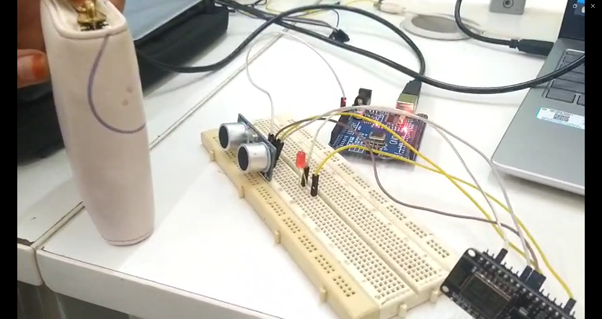
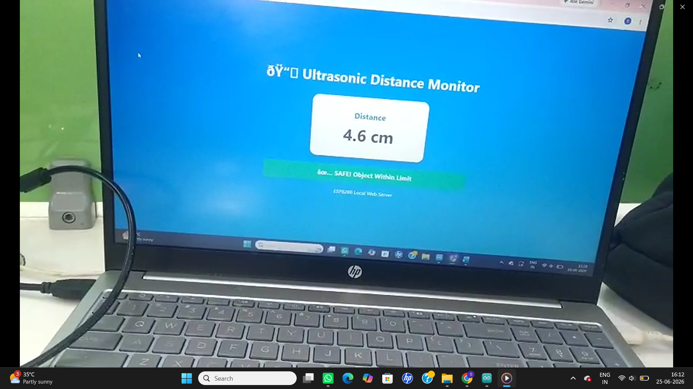

# Ultrasonic Distance Monitor using ESP8266

## Project Overview
This project measures the distance of nearby objects using an HC-SR04 Ultrasonic Sensor connected to an ESP8266. The measured distance is displayed on a web page in real time.

## Features
- Real-time distance monitoring
- ESP8266 local web server
- Attractive web interface
- Object status indication
- Wireless monitoring through browser

## Hardware Components
- ESP8266 NodeMCU
- HC-SR04 Ultrasonic Sensor
- LED
- Breadboard
- Jumper Wires

## Project Images

### Web Dashboard

### Hardware Setup

## Demo Video

🎥 [Watch Project Demo](https://drive.google.com/file/d/1Ce3LrrWuqdqoDwebxSmZDOWUzq4CT7vN/view?usp=drivesdk)

## Author

Sadhana
